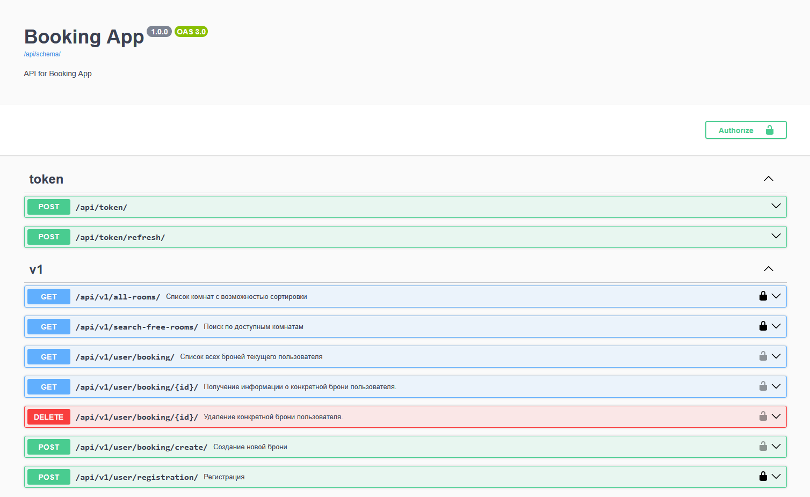
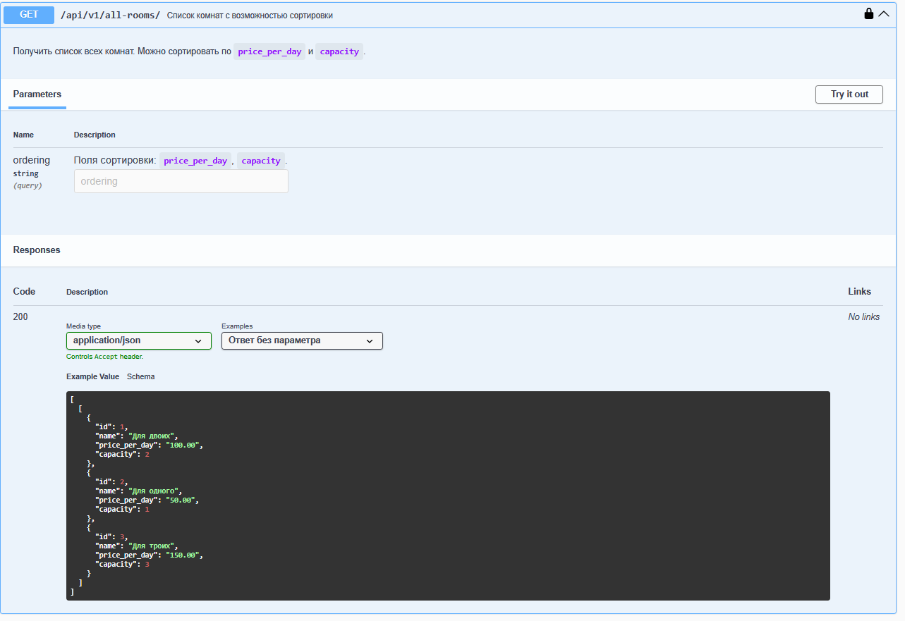
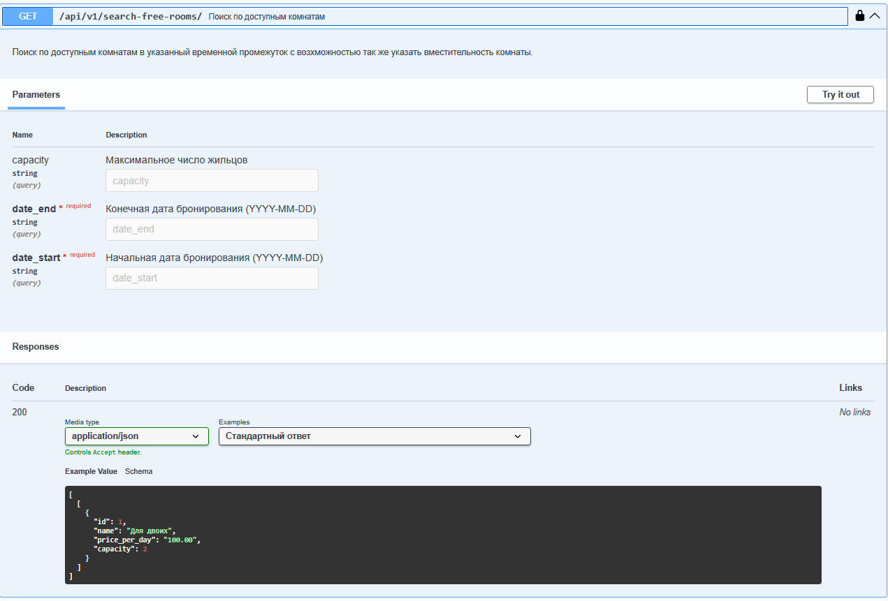
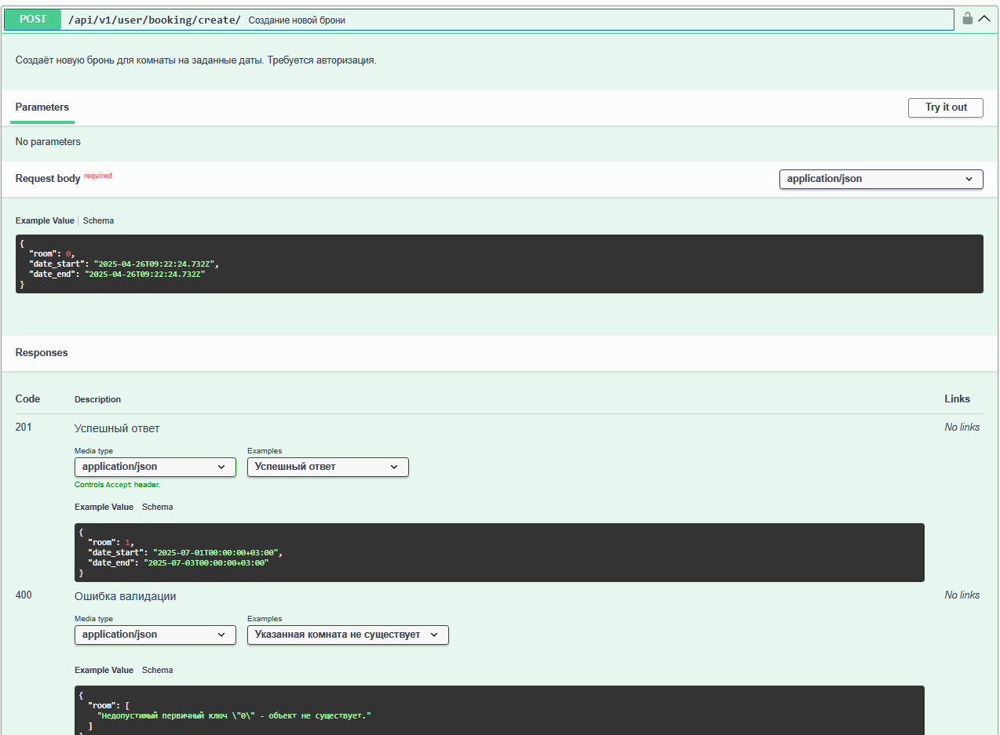
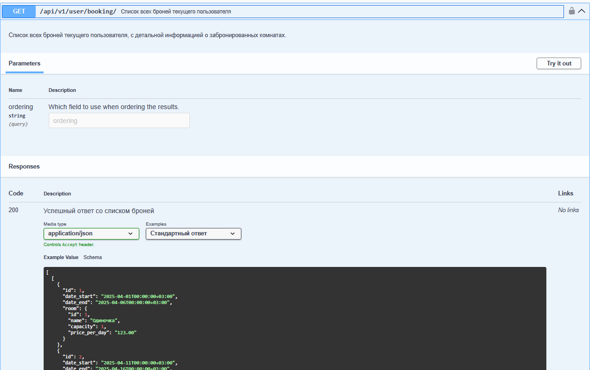
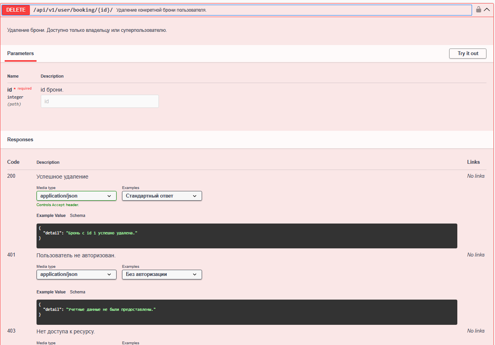
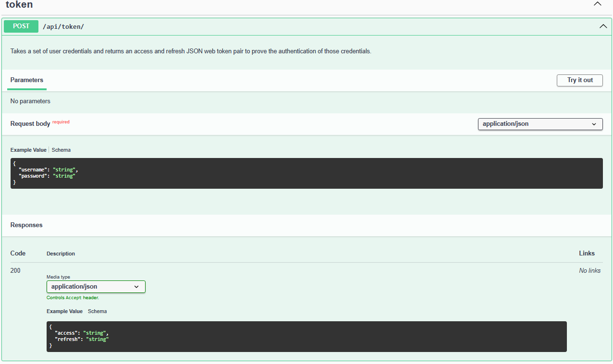
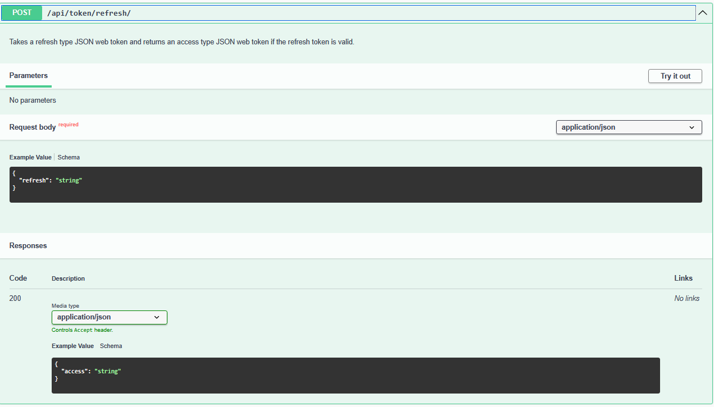
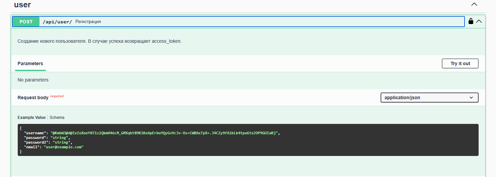

# DjangoBookingApp
## 📝Краткая информация
RestAPI приложение реализующая функционал:
* Регистрации пользователей
* Логина пользователей
* Просмотра доступных комнат для бронирования
* Бронирование комнат
* Удаление броний
* Просмотор забронированых комнат
* Редактирование и создание новых комнат администратором

---
### ⚙️Стэк
- Django
- DRF
- PostgreSQL
- docker-compose
- django-pytest
### 🔌Запуск приложения
Для запуска достаточно скачать репозеторий любым удобным способом, после чего выполнить следующие действия:
1. Перейти в дерикторию приложения
   ```
   cd booking_app
   ```
2. Запустить приложение с помошью `docker-compose`
    ```
   docker-comopse -f docker-compose.prod.yml up --build
   ```
---
### 📕Документация
Все доступные API методы и их работа должны быть достыпны тут -> [`документация`](http://127.0.0.1:8000/api/docs/), после старта приложения в докер контейнере.

---
## 📚Не краткая информация
Далее пройдусь по всем пунктам задания и опишу их реализацию

### 💃🏻Модели
Для реализации функционала необходимо три модели.
1. Пользователи - в ТЗ небыло каких-то особых требований к этой модели, поэтому использовалась стандартная модель `User`

2. Комнаты - описана модель достаточная для работы приложение. Содержит поля:
   * name - номер/название комнаты
   * price_per_day - стоимость комнаты в сутки. Для этого поля был выбран формат данных Decimal так как он считается наиболее безопасным и рекомендуемым для работы с деньгами.
   * capacity - максимальное количество проживающих в комнате
   ```python
   class Room(models.Model):
    name = models.CharField(
        max_length=100, help_text="Название/номер комнаты", unique=True, blank=False
    )
    price_per_day = models.DecimalField(
        max_digits=10,
        decimal_places=2,
        validators=[MinValueValidator(Decimal("0.01"))],
        help_text="Стоимость комнаты за сутки",
    )
    capacity = models.IntegerField(
        help_text="Колличесвто человек на которое расчитана комната",
        blank=False,
        null=False,
        validators=[MinValueValidator(1)],
    )
   ```
3. Брони - описана модель достаточная для работы приложение, тут есть интересный момент связанный с пересичениями дат, но его опишу в работе эндпоинта бронирования. 
Содержит поля:
      * date_start - дата и время заезда
      * date_end - дата и время выезда
      * room - связанное поле модели `Room`
      * user - связанное поле модели `User`
      * обе связи one-to-one

   ```python
   class Booking(models.Model):
    date_start = models.DateTimeField()
    date_end = models.DateTimeField()
    room = models.ForeignKey(Room, on_delete=models.CASCADE)
    user = models.ForeignKey(User, on_delete=models.CASCADE)

    class Meta:
        constraints = [
            ExclusionConstraint(
                name="exclude_overlapping_booking",
                expressions=[
                    (
                        TsTzRange("date_start", "date_end", RangeBoundary()),
                        RangeOperators.OVERLAPS,
                    ),
                    ("room", RangeOperators.EQUAL),
                ],
            )
        ]

    def __str__(self):
        return f"{self.user.username} – {self.room.name} – {self.date_start:%Y-%m-%d}"
   ```
---
## 🏠Фильтрация комнат
**Задача**
```
Пользователи должны уметь фильтровать и сортировать комнаты по цене, по
количеству мест.
Просматривать комнаты можно без логина.
```
**Реализация**

Простой эндпоинт реализованный с помощью встроенных механизмов `DRF`.
Используется `ListAPIView` для выдачи списка обхектов и `OrderingFilter` с параметрами `ordering_fields = ["price_per_day", "capacity"]` для реализации фильтрации по цене и вместительности.
Эндпоинт доступен для любых пользователей согласно с требованиями.
```python
class ShowRoomsApi(ListAPIView):
    queryset = Room.objects.all()
    serializer_class = RoomSerializer
    filter_backends = [OrderingFilter]
    ordering_fields = ["price_per_day", "capacity"]
```

---
## 🔎Поиск комнат
**Задача**
```
Пользователи должны уметь искать свободные комнаты в заданном временном интервале.
Просматривать комнаты можно без логина.
```
**Реализация**

Для фильтрации комнат по заданым временным промежуткам написана функция `get_free_rooms` - которая получает на вход дату заезда и дату выезда.
Далее с помощью встроенной в Djano ORM делается запрос в бд на выдачу всех пересекающихся бронирований, а затем комнаты с такими бронями просто исключаются их оющей выдачи.

```python
def get_free_rooms(date_start: datetime, date_end: datetime) -> QuerySet:
    busy_rooms = Booking.objects.filter(
        Q(date_start__lt=date_end) & Q(date_end__gt=date_start)
    ).values_list("room_id", flat=True)
    free_rooms = Room.objects.exclude(id__in=busy_rooms)
    return free_rooms
```

В эндпоинте работает сериализатор, проверяет данные на соответствия типам и что все необходимые поля присудствуют.
Так же идет проверка на корректность временного промежутка - дата заезда не позжи даты выезда, дата выезда не находиться в прошлом.
От себя добавил в работу эндпоинта опциональный фильтр по вместительности комнат, этот параметр можно не передавать он опциональный.
Эндпоинт доступен для любых пользователей согласно с требованиями.

```python
class RoomSearchParamsSerializer(serializers.Serializer):
    date_start = serializers.DateTimeField(required=True)
    date_end = serializers.DateTimeField(required=True)
    capacity = serializers.IntegerField(required=False, min_value=0, default=0)

    def validate(self, data):
        if data["date_start"] > data["date_end"]:
            raise serializers.ValidationError(
                "Дата заезда не может быть позже даты выезда."
            )
        if data["date_end"].date() < date.today():
            raise serializers.ValidationError("Дата выезда не может быть в прошлом.")
        return data
```
Код всего эндпоинта:
```python
class SearchFreeRoomApi(APIView):

    def get(self, request):
        serializer = RoomSearchParamsSerializer(data=request.query_params)
        if not serializer.is_valid():
            return Response(serializer.errors, status=status.HTTP_400_BAD_REQUEST)

        validated = serializer.validated_data
        date_start = validated["date_start"]
        date_end = validated["date_end"]
        capacity = validated["capacity"]
        free_rooms = get_free_rooms(date_start, date_end).filter(capacity__gte=capacity)
        serializer = RoomSerializer(free_rooms, many=True)

        return Response(serializer.data)
```

---
## 🔒Бронирование комнат
**Задача**
```
Пользователи должны уметь забронировать свободную комнату.
Чтобы забронировать комнату пользователи должны быть авторизованными.
```
**Решение**

Работа этого эндпоинта показалась мне самой интересной.

Фильтр для свободных комнат уже написан для предидущего задания и в этом коде будет просто периспользоваться,
то стоит вопрос "Как обеспечить атомарность операции бронирования?" - прстой прогон по фильтру и дальнейшая запись не лучши вариант, так как между 
работой фильтра и записью проходит время в которое может успеть вклиниться ещё одна бронь. 

Изначальной идеей было использовать `atomic`, но он либо так же оставляет время между проверкой и записью, либо полностью блокирует таблицу - что ещё хуже.

Отличным решением оказалось решение на уровне БД и такой способ описан в [официальной документации](https://docs.djangoproject.com/en/5.1/ref/contrib/postgres/constraints/).

Вводится ограничение на уровне само БД на предмет пересекающихся временных диапозонов для одной комнаты и автоматически отменяет записи которые пытаются его нарушить. 
Таким образом удалось обеспечить атомарность этой операции.

В задании требуется чтобы бронирование могли осуществлять только зарегистрированные пользователи и это реализуется с помощью
`permission_classes = [IsAuthenticated]`.
Так же от себя добавил `throttling` на 100 запросов в сутки с одного IP, обеспечивая дополнительную защиту проекта.

Реализована обработка ошибок с удобочитаемым выводом и предусмотрена возможность возникновения непридвиденных ошибок.


Сам код эндпоинта:
```python
class CreateBookingApi(APIView):
    permission_classes = [IsAuthenticated]
    throttle_classes = [BookingThrottle]
    serializer_class = BookingCreateSerializer

    def post(self, request):
        serializer = self.serializer_class(data=request.data)
        if serializer.is_valid():
            try:
                with transaction.atomic():
                    serializer.validated_data["user"] = request.user
                    serializer.save()
                    logger.info(
                        f"Польщователь с id  {request.user.id} создал новое бронирование {serializer.data}"
                    )
                    return Response(serializer.data, status=status.HTTP_201_CREATED)
            except ValidationError:
                raise
            # Обработка исключения от postgresql при попытке создания пересикающихся броней.
            except IntegrityError:
                return Response(
                    {
                        "detail": "Комната уже забронирована. Попробуйте изменить даты бронирования или выбирете другую комнату."
                    },
                    status=status.HTTP_409_CONFLICT,
                )
            except Exception as e:
                logger.error(
                    "Во время создания нового бронирования произошла не предвиденая ошибка:\n"
                    f"user: {request.user}\n"
                    f"data: {request.data}\n"
                    f"error: {str(e)}\n"
                    f"error_type: {type(e)}"
                )
                return Response(
                    {
                        "detail": "Сервис временно не доступен.\nПожалйста, перезагрузите страницу и попробуйте ещё раз."
                    },
                    status=status.HTTP_503_SERVICE_UNAVAILABLE,
                )

        return Response(serializer.errors, status=status.HTTP_400_BAD_REQUEST)
```

---

## 👀Просмотр броней
**Задача**
```
Авторизованные пользователи должны видеть свои брони.
```
Использован `permission_classes = [IsAuthenticated]` чтобы выполнить требования. 
Переписан `get_queryset` чтобы данные выдавались только текущего пользователя.
**Решение**

```python
class UserAllBookingApi(ListAPIView):
    permission_classes = [IsAuthenticated]
    queryset = Booking.objects.all().prefetch_related("room")
    serializer_class = BookingSerializer

    def get_queryset(self):
        return Booking.objects.filter(user=self.request.user).prefetch_related("room")
```

---
## 🧙‍♂️Суперпользователь
**Задача**
```
Суперюзер должен уметь добавлять/удалять/редактировать комнаты и редактировать записи о бронях через админ панель Django.
```
**Решение**
Просто импортируем модель в администраторскую панель Django, весь функционал уже реализован в самом фреймворке.
О пересичении бронирования в процессе редактирования можно не переживать из-за решения на уровне БД описанного выше.

Код:
```python
@admin.register(Room)
class RoomAdmin(admin.ModelAdmin):
    list_display = ("id", "name", "price_per_day", "capacity")
    list_filter = ("price_per_day", "capacity")


@admin.register(Booking)
class BookingAdmin(admin.ModelAdmin):
    list_display = ("id", "room", "user", "date_start", "date_end")
    list_filter = ("room", "user", "date_start")
    search_fields = ("room__name", "user__username")
```

---
## Отмена броней
**Задача**
```
Брони могут быть отменены как самим юзером, так и суперюзером.
```
**Решение**
Разработал эндпоинт для получения данных о конкретной брони и реализовал в нем метод `destroy`.
Для того чтобы доступ к данным могу получить только владелиц или суперпользователь реализовал кастомный `permission_classes = [IsOwnerOrSuperUser]`

```python
class IsOwnerOrSuperUser(BasePermission):
    def has_object_permission(self, request, view, obj):
        return request.user == obj.user or request.user.is_superuser
```
С помощью `get_object` получаем объект который будем удалять, и зарание создаем текст для успешного ответа об удалении так как потом не получиться сослаться на объект.

Код:
```python
class UserBookingApi(RetrieveDestroyAPIView):
    queryset = Booking.objects.all().select_related("room")
    serializer_class = BookingSerializer
    permission_classes = [IsOwnerOrSuperUser]

    def destroy(self, request, *args, **kwargs):
        instance = self.get_object()
        response_text = f"Бронь с id {instance.id} успешно удалена."
        self.perform_destroy(instance)
        return Response({"detail": response_text}, status=status.HTTP_200_OK)
```

---
## 🛂Регистрация и авторизация
**Задача**
```
Пользователи должны уметь регистрироваться и авторизовываться (логиниться).
```
**Решение**
Для авторизации использовал jwt-токены с помощью simplejwt.
Для удобства тестирования и проверки поставил срок жизни для `ACCESS_TOKEN` - 2 часа.

Решение полностью реализованно с помощью библиотеки.
Два эндпоинта, один - для получения токена, второй - для его обновления.
```python
path("api/token/", TokenObtainPairView.as_view(), name="token_obtain_pair"),
path("api/token/refresh/", TokenRefreshView.as_view(), name="token_refresh")
```


Логика выхода по заданию не нужна, а на практике решается на стороне фронтенда, через бэкенд решается костылями с черным списком.

Для регистрации реализован следующий эндпоинт. Тут я всю логику создания нового пользователя обернул в транзакцию - сделано это для того, чтобы пр ошибке не связанной с работой бд пользователь не получал 
ошибку регистрации при том что его данные уже в БД.

Добавил тротлинг для защиты проекта.
При успешной регистрации отдается токен чтобы фронтенд мог продолжить работу с пользователем ужен как с зарегистрированным.

Код:
```python
class UserRegistrationApi(generics.CreateAPIView):
    queryset = User.objects.all()
    permission_classes = [AllowAny]
    serializer_class = RegistrationSerializer
    throttle_classes = [UserRegistrationThrottle]

    def create(self, request, *args, **kwargs):
        serializer = self.serializer_class(data=request.data)
        try:
            with transaction.atomic():
                serializer.is_valid(raise_exception=True)
                user = serializer.save()
                refresh = RefreshToken.for_user(user)
                response_data = {
                    "access_token": str(refresh.access_token),
                }
                return Response(response_data, status=status.HTTP_201_CREATED)
        except ValidationError:
            raise

        except Exception as e:
            logger.error(
                "Вовремя регистрации нового пользователя проищошла непредвиденая ошибка.\n"
                f"data: {request.data}\n"
                f"error: {str(e)}"
            )
            return Response(
                {"detail": "Произошла непредвиденная ошибка. Попробуйте позднее."},
                status=status.HTTP_500_INTERNAL_SERVER_ERROR,
            )
```

---

## 👋Приветствуется

### Автотесты
### Аннотации типов
### Линтер
### Автоформатирование кода
### Документации типов
### Инструкция к запуску