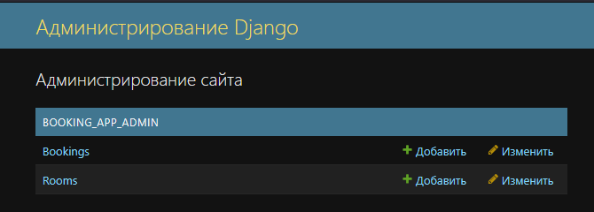

[](https://coveralls.io/github/sweetsenpai/DjangoBookingApp)
[](https://github.com/sweetsenpai/DjangoBookingApp/actions/workflows/tests.yml)
[](https://www.djangoproject.com/)
[](https://www.django-rest-framework.org/)
[](https://www.python.org/downloads/release/python-3100/)

# DjangoBookingApp
## 📝Краткая информация
RestAPI приложение реализующее функционал:
* [Регистрации пользователей](#регистрация-и-авторизация)
* [Логина пользователей](#регистрация-и-авторизация)
* [Просмотра доступных комнат для бронирования](#фильтрация-комнат)
* [Бронирование комнат](#бронирование-комнат)
* [Удаление броний](#%EF%B8%8Fотмена-броней)
* [Просмотр забронированных комнат](#просмотр-броней)
* [Редактирование и создание новых комнат администратором](#%EF%B8%8Fсуперпользователь)

---
### ⚙️Стэк
- Django
- DRF
- PostgreSQL
- docker-compose
- django-pytest
- Docker
- docker-compose
---
### 🔌Запуск приложения
Для запуска достаточно скачать репозиторий любым удобным способом, после чего выполнить следующие действия:
1. Перейти в директорию приложения
   ```commandline
   cd booking_app
   ```
2. Запустить приложение с помощью `docker-compose`
    ```commandline
   docker-compose -f docker-compose.prod.yml up --build
   ```
3. Для полноценной работы с приложением потребуется создать суперпользователся.
   Сделать это можно следующим образом:
   1. Необходимо перейти в контейнер django:
      ```commandline
      docker exec -it django bash
      ```
   2. Далее необходимо ввести команду ниже в консоль и следовать указаниям Django:
      ```commandline
         python manage.py createsuperuser
      ```

*Опционально*:
Для самостоятельного запуска тестов, перейдите в директорию проекта и используйте команду: 
```commandline
docker-compose -f docker-compose.test.yml up --build
```
---
### 📕Документация
Все доступные API методы и их работа должны быть доступны тут -> [`документация`](http://127.0.0.1:8000/api/docs/), после старта приложения.


---

### 🌳Структура проекта
- **[`🗂booking_app/`](booking_app/booking_app)** — Модуль с настройками:
    - ⚙️ [`settings_prod`](booking_app/booking_app/settings_prod.py) — Основные настройки Django.
    - ⚙️ [`settings_dev`](booking_app/booking_app/settings_dev.py) — Настройки Django для разработки.
    - ⚙️ [`settings_dev`](booking_app/booking_app/settings_test.py) — Настройки Django для тестирования.
- **[`🗂booking_app_admin/`](booking_app/booking_app_admin)** — Модуль с моделями и настройками панели администратора:
  - 💃🏻 [`models`](booking_app/booking_app_admin/models.py) — Модели.
  - 🧙‍♂️ [`admin`](booking_app/booking_app_admin/admin.py) — Настройки панели администратора.
  - 🤖 [`tests`](booking_app/booking_app_admin/tests) — Тесты моделей.
- **[`🗂booking_app_api/`](booking_app/booking_app_api)** — Модуль с api:
  - 📌 [`🗂v1`](booking_app/booking_app_api/v1) — Основной модуль текущего приложения, вынесен в отдельную папку для поддержки версионирования.
  - - 🔪 [`serializers`](booking_app/booking_app_api/v1/serializers) — Сериализаторы.
  - -  💻[`views`](booking_app/booking_app_api/v1/views) — Views API.
  - 🤖 [`tests`](booking_app/booking_app_api/tests) — Тесты.
  - ⚒️ [`utils`](booking_app/booking_app_api/utils) — Вспомогательные утилиты для работы API.
- **⚓️[`docker-compose.prod.yml`](booking_app/docker-compose.prod.yml)** — `docker-compose` для продакшн среды.
- **⚓️[`docker-compose.dev.yml`](booking_app/docker-compose.dev.yml)** — `docker-compose` для разработки.
- **⚓️[`docker-compose.test.yml`](booking_app/docker-compose.test.yml)** — `docker-compose` для тестирования.
- **🐳[`Docker.prod`](booking_app/Dockerfile.prod)** — `Dockerfile` для продакшн среды.
- **🐳[`Docker.dev`](booking_app/Dockerfile.dev)** — `Dockerfile` для разработки и тестов.
- **📀[`init.sql`](booking_app/init.sql)** — init-файл для postgresql, для загрузки необходимых для работы расширений.
- **📚[`logs/`](booking_app/logs)** — Папка для хранения логов, реализована ротация файлов логирования.
- - **[`🟥critical.log`]** — логирование критических ошибок.
- - **[`🟨error.log`]** — логирование ошибок.
- - **[`🟩info.log`]** — логирование.


---
## 📚Не краткая информация
Далее пройдусь по всем пунктам задания и опишу их реализацию

### 💃🏻Модели
Для реализации функционала необходимо три модели.
1. Пользователи - в ТЗ не было каких-то особых требований к этой модели, поэтому использовалась стандартная модель `User`

2. Комнаты - описана модель достаточная для работы приложения. Содержит поля:
   * `name` - номер/название комнаты
   * `price_per_day` - стоимость комнаты в сутки. Для этого поля был выбран формат данных Decimal так как он считается наиболее безопасным и рекомендуемым для работы с деньгами.
   * `capacity` - максимальное количество проживающих в комнате
     
   ```python
   class Room(models.Model):
    name = models.CharField(
        max_length=100, help_text="Название/номер комнаты", unique=True, blank=False
    )
    price_per_day = models.DecimalField(
        max_digits=10,
        decimal_places=2,
        validators=[MinValueValidator(Decimal("0.01"))],
        help_text="Стоимость комнаты за сутки",
    )
    capacity = models.IntegerField(
        help_text="Количество человек на которое рассчитана комната",
        blank=False,
        null=False,
        validators=[MinValueValidator(1)],
    )
   ```
3. Брони - описана модель достаточная для работы приложение, тут есть интересный момент связанный с пересечениями дат, но его опишу в работе эндпоинта бронирования. 
Содержит поля:
      * `date_start` - дата и время заезда
      * `date_end` - дата и время выезда
      * `room` - связанное поле модели `Room`
      * `user` - связанное поле модели `User`
      * обе связи `many-to-one`

   ```python
   class Booking(models.Model):
    date_start = models.DateTimeField()
    date_end = models.DateTimeField()
    room = models.ForeignKey(Room, on_delete=models.CASCADE)
    user = models.ForeignKey(User, on_delete=models.CASCADE)

    class Meta:
        constraints = [
            ExclusionConstraint(
                name="exclude_overlapping_booking",
                expressions=[
                    (
                        TsTzRange("date_start", "date_end", RangeBoundary()),
                        RangeOperators.OVERLAPS,
                    ),
                    ("room", RangeOperators.EQUAL),
                ],
            )
        ]

    def __str__(self):
        return f"{self.user.username} – {self.room.name} – {self.date_start:%Y-%m-%d}"
   ```
   Проект содержит в себе миграции необходимые для работы postgresql с `exclusion constraint`.
---
## 🏠Фильтрация комнат
**Задача**
```
Пользователи должны уметь фильтровать и сортировать комнаты по цене, по
количеству мест.
Просматривать комнаты можно без логина.
```
**Реализация**

Простой эндпоинт реализованный с помощью встроенных механизмов `DRF`.
Используется `ListAPIView` для выдачи списка объектов и `OrderingFilter` с параметрами `ordering_fields = ["price_per_day", "capacity"]` для реализации фильтрации по цене и вместительности.
Эндпоинт доступен для любых пользователей согласно с требованиями.

```python
class ShowRoomsApi(ListAPIView):
    """
    API endpoint - возвращает список из всех комнат,
    с возможностью сортировки по полям price_per_day и capacity.

    Каждый элемент списка содержит id, name, price_per_day, capacity.
    """

    queryset = Room.objects.all()
    serializer_class = RoomSerializer
    filter_backends = [OrderingFilter]
    ordering_fields = ["price_per_day", "capacity"]
```

---
## 🔎Поиск комнат
**Задача**
```
Пользователи должны уметь искать свободные комнаты в заданном временном интервале.
Просматривать комнаты можно без логина.
```
**Реализация**

Для фильтрации комнат по заданым временным промежуткам написана функция `get_free_rooms` - которая получает на вход дату заезда и дату выезда.
Далее с помощью встроенной в Django ORM делается запрос в бд на выдачу всех пересекающихся бронирований, а затем комнаты с такими бронями просто исключаются из общей выдачи.

```python
def get_free_rooms(date_start: datetime, date_end: datetime) -> QuerySet:
    """
    Поиск свободных комнат в заданный временной промежуток.
     
    :param date_start: дата заезда
    :param date_end: дата выезда
    :return: возвращает QuerySet с доступными комнатами по заданым параметрам
    """

    busy_rooms = Booking.objects.filter(
        Q(date_start__lt=date_end) & Q(date_end__gt=date_start)
    ).values_list("room_id", flat=True)
    free_rooms = Room.objects.exclude(id__in=busy_rooms)
    return free_rooms
```

В эндпоинте работает сериализатор, проверяет данные на соответствия типам и что все необходимые поля присудствуют.
Так же идет проверка на корректность временного промежутка - дата заезда не позжи даты выезда, дата выезда не находиться в прошлом.
От себя добавил в работу эндпоинта  фильтр по вместительности комнат, этот параметр можно не передавать он опциональный.
Эндпоинт доступен для любых пользователей согласно с требованиями.

```python
class RoomSearchParamsSerializer(serializers.Serializer):
    date_start = serializers.DateTimeField(required=True)
    date_end = serializers.DateTimeField(required=True)
    capacity = serializers.IntegerField(required=False, min_value=0, default=0)

    def validate(self, data):
        if data["date_start"] > data["date_end"]:
            raise serializers.ValidationError(
                "Дата заезда не может быть позже даты выезда."
            )
        if data["date_end"].date() < date.today():
            raise serializers.ValidationError("Дата выезда не может быть в прошлом.")
        return data
```
Код всего эндпоинта:
```python
class SearchFreeRoomApi(APIView):
    """
    API endpoint для поиска доступных комнат.

    Этот endpoint предоставляет возможность получить список свободных комнат
    для аренды в заданном временном промежутке. Пользователь должен
    указать начальную и конечную даты бронирования, а также может
    дополнительно задать вместимость комнаты. 
    
    Параметры запроса (query parameters):
    - date_start (обязательный): Начальная дата бронирования в формате YYYY-MM-DD.
    - date_end (обязательный): Конечная дата бронирования в формате YYYY-MM-DD.
    - capacity (необязательный): Минимальная требуемая вместимость комнаты.
    """

    def get(self, request):
        serializer = RoomSearchParamsSerializer(data=request.query_params)
        serializer.is_valid(raise_exception=True)

        validated = serializer.validated_data
        date_start = validated["date_start"]
        date_end = validated["date_end"]
        capacity = validated["capacity"]

        free_rooms = get_free_rooms(date_start, date_end).filter(capacity__gte=capacity)
        serializer = RoomSerializer(free_rooms, many=True)

        return Response(serializer.data)
```

---
## 🔒Бронирование комнат
**Задача**

```
Пользователи должны уметь забронировать свободную комнату.
Чтобы забронировать комнату пользователи должны быть авторизованными.
```
**Решение**

Работа этого эндпоинта показалась мне самой интересной.

Фильтр для свободных комнат уже написан для предыдущего задания и если в этом коде будет просто переиспользоваться,
то встанет вопрос "Как обеспечить атомарность операции бронирования?" -простой прогон по фильтру и дальнейшая запись не лучши вариант, так как между 
работой фильтра и записью проходит время в которое может успеть вклиниться ещё одна бронь. 

Изначальной идеей было использовать `atomic`, но он либо так же оставляет время между проверкой и записью, либо полностью блокирует таблицу - что ещё хуже.

Отличным решением оказалось решение на уровне БД и такой способ описан в [официальной документации](https://docs.djangoproject.com/en/5.1/ref/contrib/postgres/constraints/), но стоит учесть что такое решение возможно только с postgresql

Вводится ограничение на уровне самой БД на предмет пересекающихся временных диапазонов для одной комнаты и автоматически отменяет записи которые пытаются его нарушить. 
Таким образом удалось обеспечить атомарность этой операции.

В задании требуется чтобы бронирование могли осуществлять только зарегистрированные пользователи и это реализуется с помощью
`permission_classes = [IsAuthenticated]`.
Также я добавил `throttling` на 100 запросов в сутки с одного IP, обеспечивая дополнительную защиту проекта.

Реализована обработка ошибок с удобочитаемым выводом и предусмотрена возможность возникновения непредвиденных ошибок.


Сам код эндпоинта:

```python
class CreateBookingApi(APIView):
    """
    API для создания новой брони.

    Этот API позволяет авторизованным пользователям создавать новые бронирования для комнат на заданные даты.
    Бронь создается с указанием даты начала, окончания и id номера. В случае ошибок, возвращаются соответствующие сообщения
    с кодами статуса.

    Валидация включает проверку существования комнаты, формата дат и пересечения броней.
    """
    permission_classes = [IsAuthenticated]
    throttle_classes = [BookingThrottle]
    serializer_class = BookingCreateSerializer

    def post(self, request):
        """
        Метод для создания новой брони.
    
        Этот метод обрабатывает POST-запрос для создания новой брони. 
        После успешной валидации данных, бронь сохраняется в базе данных. 
        Возможные коды ответа:
        - 201: Успешное создание новой брони.
        - 400: Ошибка валидации данных.
        - 409: Конфликт. Комната уже забронирована для указанных дат.
        - 503: Непредвиденная ошибка сервиса.
    
        Параметры:
        - room (int): Идентификатор комнаты.
        - date_start (datetime): Начало брони.
        - date_end (datetime): Конец брони.
        """
        serializer = self.serializer_class(data=request.data)
        serializer.is_valid(raise_exception=True)
        try:
            with transaction.atomic():
                serializer.validated_data["user"] = request.user
                serializer.save()
                logger.info(
                    f"Пользователь с id  {request.user.id} создал новое бронирование {serializer.data}"
                )
                return Response(serializer.data, status=status.HTTP_201_CREATED)
        # Обработка исключения от postgresql при попытке создания пересекающихся броней.
        except IntegrityError:
            return Response(
                {
                    "detail": "Комната уже забронирована. Попробуйте изменить даты бронирования или выберите другую комнату."
                },
                status=status.HTTP_409_CONFLICT,
            )
        except Exception as e:
            logger.error(
                "Во время создания нового бронирования произошла непредвиденная ошибка:\n"
                f"user: {request.user}\n"
                f"data: {request.data}\n"
                f"error: {str(e)}\n"
                f"error_type: {type(e)}"
            )
            return Response(
                {
                    "detail": "Сервис временно недоступен.Пожалуйста, перезагрузите страницу и попробуйте ещё раз."
                },
                status=status.HTTP_503_SERVICE_UNAVAILABLE,
            )
```

---

## 👀Просмотр броней
**Задача**
```
Авторизованные пользователи должны видеть свои брони.
```
Использован `permission_classes = [IsAuthenticated]` чтобы выполнить требования. 
Переписан `get_queryset` чтобы данные выдавались только для текущего пользователя.
**Решение**

```python
class UserAllBookingApi(ListAPIView):
    """
    API endpoint для получения данных о всех бронированиях пользователя.
    
    Endpoint доступен только для зарегистрированных пользователей.
    
    Этот endpoint возвращает список объектов бронирования и связанную с ним комнату,
    по его id.

    Объект бронирования содержит в себе поля id, date_start, date_end, room(id, name, capacity, price_per_day).
    """
    permission_classes = [IsAuthenticated]
    queryset = Booking.objects.all().prefetch_related("room")
    serializer_class = BookingSerializer

    def get_queryset(self):
        return Booking.objects.filter(user=self.request.user).prefetch_related("room")
```

---
## 🧙‍♂️Суперпользователь
**Задача**
```
Суперюзер должен уметь добавлять/удалять/редактировать комнаты и редактировать записи о бронях через админ панель Django.
```
**Решение**

Просто импортируем модель в администраторскую панель Django, весь функционал уже реализован в самом фреймворке.
О пересичении бронирования в процессе редактирования можно не переживать из-за решения на уровне БД описанного выше.

Код:
```python
@admin.register(Room)
class RoomAdmin(admin.ModelAdmin):
    list_display = ("id", "name", "price_per_day", "capacity")
    list_filter = ("price_per_day", "capacity")


@admin.register(Booking)
class BookingAdmin(admin.ModelAdmin):
    list_display = ("id", "room", "user", "date_start", "date_end")
    list_filter = ("room", "user", "date_start")
    search_fields = ("room__name", "user__username")
```

---
## 🙅‍♂️Отмена броней
**Задача**
```
Брони могут быть отменены как самим юзером, так и суперюзером.
```
**Решение**

Разработал эндпоинт для получения данных о конкретной брони и реализовал в нем метод `destroy`.
Для того чтобы доступ к данным могу получить только владелиц или суперпользователь реализовал кастомный `permission_classes = [IsOwnerOrSuperUser]`

```python
class IsOwnerOrSuperUser(BasePermission):
    def has_object_permission(self, request, view, obj):
        return request.user == obj.user or request.user.is_superuser
```
С помощью `get_object` получаем объект который будем удалять, и зарание создаем текст для успешного ответа об удалении так как потом не получиться сослаться на объект.

Код:
```python
class UserBookingApi(RetrieveDestroyAPIView):
    """
    API endpoint для получения данных о бронировании с возможностью удаления брони.
    
    Endpoint доступен только для владельца брони и суперпользователя.
    
    Этот endpoint возвращает объект бронирования и связанную с ним комнату,
    по его id, с помощью метода delete можно удалить бронирование.

    Объект бронирования содержит в себе поля id, date_start, date_end, room(id, name, capacity, price_per_day).
    """
    queryset = Booking.objects.all().select_related("room")
    serializer_class = BookingSerializer
    permission_classes = [IsOwnerOrSuperUser]

    def destroy(self, request, *args, **kwargs):
        instance = self.get_object()
        response_text = f"Бронь с id {instance.id} успешно удалена."
        self.perform_destroy(instance)
        return Response({"detail": response_text}, status=status.HTTP_200_OK)
```

---
## 🛂Регистрация и авторизация
**Задача**
```
Пользователи должны уметь регистрироваться и авторизовываться (логиниться).
```
**Решение**

Для авторизации использовал jwt-токены с помощью simplejwt.
Для удобства тестирования и проверки поставил срок жизни для `ACCESS_TOKEN` - 2 часа.

Решение полностью реализованно с помощью библиотеки.
Два эндпоинта, один - для получения токена, второй - для его обновления.
```python
path("api/token/", TokenObtainPairView.as_view(), name="token_obtain_pair"),
path("api/token/refresh/", TokenRefreshView.as_view(), name="token_refresh")
```


Логика выхода по заданию не нужна, а на практике решается на стороне фронтенда, через бэкенд решается костылями с черным списком.

Для регистрации реализован следующий эндпоинт. Тут я всю логику создания нового пользователя обернул в транзакцию - сделано это для того, чтобы при ошибке не связанной с работой бд пользователь не получал 
ошибку регистрации при том что его данные уже в БД.

Добавил тротлинг для защиты проекта.
При успешной регистрации отдается токен чтобы фронтенд мог продолжить работу с пользователем ужен как с зарегистрированным.

Код:
```python
class UserRegistrationApi(generics.CreateAPIView):
    """
    API эндпоинт для регистрации нового пользователя.

    Данный эндпоинт создает нового пользователя с предоставленными данными (username, password, password2, email),
    валидирует их и возвращает access_token при успешной регистрации.


    Примечание:
    - Этот эндпоинт доступен без авторизации.
    - Данные в поле password должны удовлетворять требованиям безопасности (минимальная длина, сложность).
    """

    queryset = get_user_model().objects.all()
    permission_classes = [AllowAny]
    serializer_class = RegistrationSerializer
    throttle_classes = [UserRegistrationThrottle]

    def create(self, request, *args, **kwargs):
        serializer = self.serializer_class(data=request.data)
        try:
            with transaction.atomic():
                serializer.is_valid(raise_exception=True)
                user = serializer.save()
                refresh = RefreshToken.for_user(user)
                response_data = {
                    "access_token": str(refresh.access_token),
                }
                return Response(response_data, status=status.HTTP_201_CREATED)
        except ValidationError:
            raise

        except Exception as e:  # pragma: no cover
            logger.error(
                "Вовремя регистрации нового пользователя проищошла непредвиденая ошибка.\n"
                f"data: {request.data}\n"
                f"error: {str(e)}"
            )
            return Response(
                {"detail": "Произошла непредвиденная ошибка. Попробуйте позднее."},
                status=status.HTTP_500_INTERNAL_SERVER_ERROR,
            )
```

---

## 👋Приветствуется

---
### Автотесты
Тесты прогоняются в контейнере так как для работы приложения необходим postgresql.
Контейнер можно запустить самостоятельно с помощью команды:
```commandline
docker-compose -f docker-compose.test.yml up --build
```

Так же тесты запускаются автоматически при изменениях в ветке `main` с помощью `github workflows`. 
После прохождения тестов формируется отчет и загружается на [coveralls.io](https://coveralls.io/github/sweetsenpai/DjangoBookingApp)

Покрытие тестами составляет 100%.

Тесты написаны с помощью `pytest-django`.
С конфигурацией pytest можно ознакомиться тут:
* [conftest.py📝](booking_app/conftest.py)
* [pytest.ini📝](booking_app/pytest.ini)
* [settings_test.py📝](booking_app/booking_app/settings_test.py)

### Линтер
При запуске тестов так же запускается pylint. На данный моментоценка кода `8.7/10`.
С конфигурацией pytest можно ознакомиться тут:
* [pylintrc📝](booking_app/.pylintrc)

UPD:
К сожалению пришлось убрать pylint из workflow так как он приводил к нестабильной работе, время от времени завершая работу контейнера с кодом 22.

### Автоформатирование кода

На проекте использовались isort и black.
Их конфигурация находится тут: 
* [pyproject.toml📝](booking_app/pyproject.toml)

---
## Дополнительно
Дополнительно на проекте можно было бы настроить:
* `celery` - для асинхронных задач
* `reddis` - для хранения кэша и в качестве брокера сообщений.
* `senrty` - для мониторинга ошибок.
* `grafana + prometheus` - для мониторинга.
* `flower` - для мониторинга `celery`.
